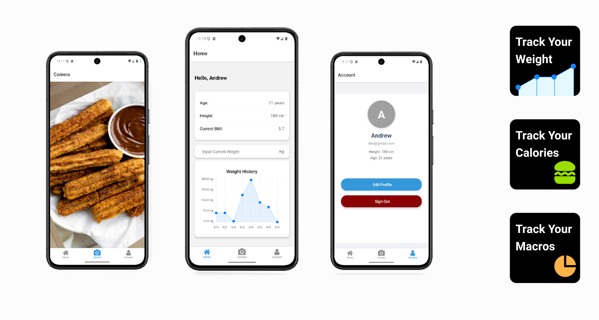

# Fitter Mobile



**Fitter Mobile** is the mobile version of *Fitter*, a deep learning application that recognizes types of food and estimates their nutritional values. This project is built in TypeScript (React Native / Expo) to provide users with an easy way to identify food from photos on mobile devices.

---

## Table of Contents

* [Features](#features)
* [Demo / Screenshots](#demo--screenshots)
* [Architecture & Key Components](#architecture--key-components)
* [Setup / Installation](#setup--installation)
* [Usage](#usage)
* [Configuration](#configuration)
* [Deployment](#deployment)
* [Troubleshooting](#troubleshooting)
* [Contributing](#contributing)
* [License](#license)

---

## Features

* Image classification of food types
* Nutritional value estimation for recognized food
* Integration with Firebase and Firebase ML / TensorFlow Lite
* Cross‑platform support (iOS & Android)
* TypeScript codebase
* Configurable via `app.json`, `eas.json`, etc.

---

## Demo / Screenshots

*(Include some screenshots or link to a demo if available.)*

---

## Architecture & Key Components

Here are some of the important folders/files and what they do:

| Path / File                           | Purpose                                                     |
| ------------------------------------- | ----------------------------------------------------------- |
| `components/`                         | UI / reusable React Native components                       |
| `app/`                                | Entry point of the app, navigation, screens, etc.           |
| `constants/`                          | Constants used across the project                           |
| `FirebaseConfig.ts`                   | Firebase project configuration                              |
| `FirebaseMLService.ts`                | Interface / methods for invoking Firebase ML features       |
| `TensorFlowLiteRealImplementation.ts` | If using TensorFlow Lite implementation for local inference |
| `metro.config.js`                     | Metro bundler configuration                                 |
| `tsconfig.json`                       | TypeScript configuration                                    |
| `package.json`                        | Project dependencies and scripts                            |

Also includes helper documentation:

* `TENSORFLOW_LITE_FIX_GUIDE.md` — Fixes/workarounds for TFLite integration.
* `FIREBASE_ML_INTEGRATION_README.md` — Notes for integrating Firebase ML.

---

## Setup / Installation

To run this project locally:

1. Clone the repo:

   ```bash
   git clone https://github.com/alvrian/fitter-mobile.git
   cd fitter-mobile
   ```

2. Install dependencies:

   ```bash
   npm install
   # or
   yarn install
   ```

3. Set up required configuration:

   * Copy or update `FirebaseConfig.ts` with your Firebase credentials.
   * Make any other configuration in `app.json`, `eas.json`, etc.

4. Run the app:

   ```bash
   npm run start
   # or use expo / eas commands if using Expo
   ```

5. To build for Android / iOS:

   ```bash
   npm run android
   npm run ios
   ```

   *(Assuming the proper setup is done for both platforms.)*

---

## Configuration

Make sure to configure:

* **Firebase**: Provide project ID, API key, etc. in `FirebaseConfig.ts`.
* **Model paths** (for TensorFlow Lite), if using local inference.
* **Permissions**: camera access, media library, etc. depending on platform.

---

## Deployment

If you are using **Expo** or **Expo Application Services (EAS)**:

* Use `eas.json` for configuring builds.
* Make sure to set up app signing and credentials for Android/iOS.

For production builds:

* Optimize assets.
* Test model inference performance on device.
* Reduce bundle sizes if possible.

---

## Troubleshooting

Some common issues & solutions:

| Issue                                   | Solution                                                                                                       |
| --------------------------------------- | -------------------------------------------------------------------------------------------------------------- |
| TensorFlow Lite model failing on device | Check Android/iOS architecture (arm64 vs x86), verify model format, and follow `TENSORFLOW_LITE_FIX_GUIDE.md`. |
| Firebase ML not detecting images        | Ensure proper permissions, correct use of image input format, and that the Firebase project is configured.     |
| App crashes on startup                  | Verify config files (`app.json`, etc.), correct environment variables, dependency mismatches.                  |

---


## Credits / References

* Previous “Fitter” web version: [TiffanyJoyCelyn/fitter](https://github.com/tiffanyjoycelyn/fitter)
* TensorFlow Lite documentation
* Firebase ML / Firebase documentation
